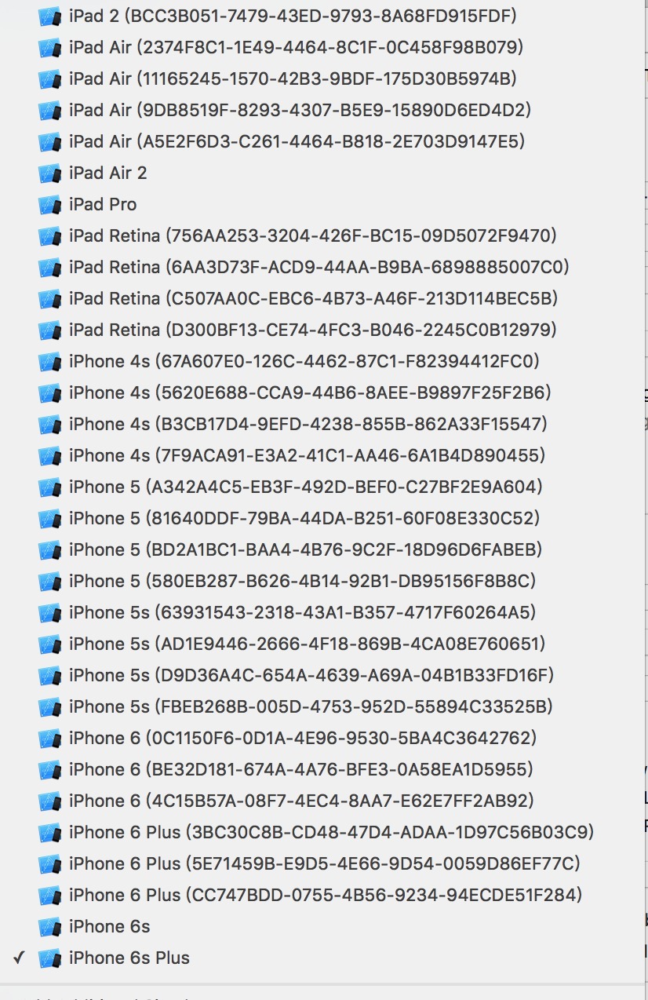

# CleanSimulators

### Clear dumped iOS Simulators

Useage:
```shell
$ sh CleanSimulators.sh
```

Script in CleanSimulators.sh
```shell
#!/bin/bash

#written by liuyuning

killall Xcode
killall Simulator
sudo killall -9 com.apple.CoreSimulator.CoreSimulatorService
rm -rf ~/Library/Developer/CoreSimulator/Devices
```

The Dumped Simulators!


